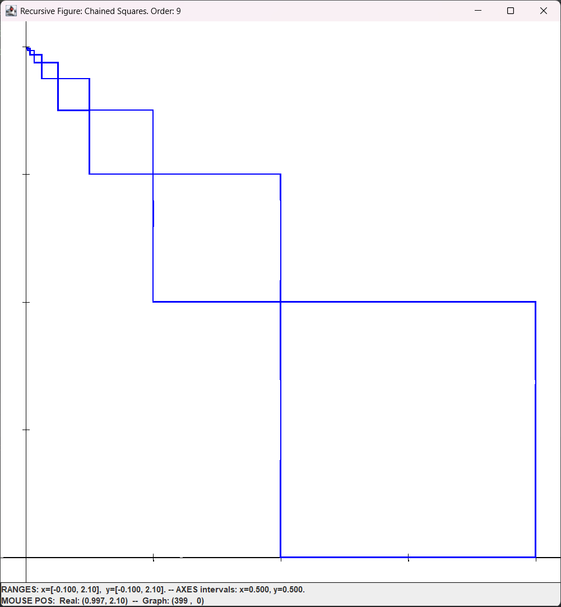
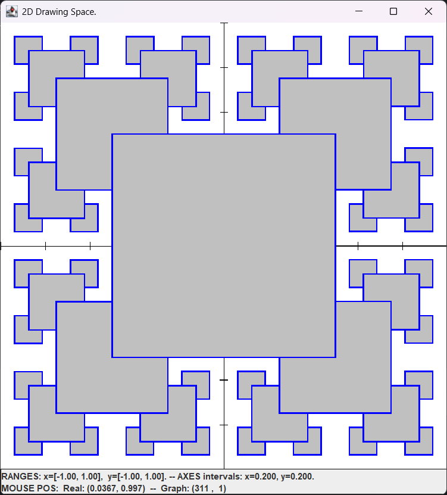
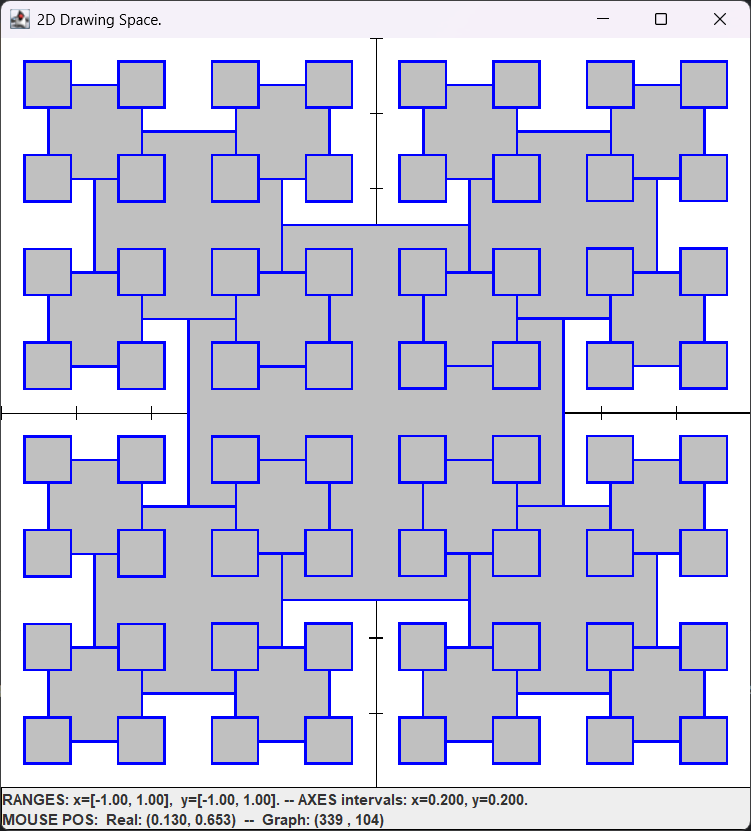

# Recursive Fractals

This project demonstrates the creation of recursive fractal figures using Java. Through different implementations, it visualizes how recursive algorithms can generate complex and visually appealing geometric patterns.

## Contents

- [Installation](#installation)
- [Usage](#usage)
- [Features](#features)
- [Visual Examples](#visual-examples)
- [Technical Details](#technical-details)
- [Dependencies](#dependencies)

## Installation

1. Clone this repository:
   ```bash
   git clone https://github.com/abdelachbani/Recursive-Fractals.git
   ```

2. Make sure you have Java JDK 8 or higher installed.

3. Open the project in your favorite IDE (IntelliJ IDEA recommended).

4. Verify that the external library `graphLib.jar` is correctly configured in the project's classpath.

## Usage

The project contains two main classes:

### SimpleRecFig

This class implements figures of diagonally chained squares:

```java
// Draw a recursive figure with 5 squares
SimpleRecFig.recFig(5);

// Draw an iterative figure with 5 squares
SimpleRecFig.iterFig(5);
```

### RSquare

This class implements two types of recursive square patterns:

```java
// Draw an RSquare-A pattern of order 4
RSquare.rSquareA(4);

// Draw an RSquare-B pattern of order 4
RSquare.rSquareB(4);
```

## Features

- **Recursive and iterative implementation**: Comparison of both approaches to generate the same patterns.
- **Different types of fractals**:
  - Diagonally chained squares (SimpleRecFig)
  - Type A recursive square patterns (RSquare)
  - Type B recursive square patterns (RSquare)
- **Step-by-step visualization**: Animation of the drawing process with delays to visualize the construction.
- **Customization**: Ability to adjust parameters such as size, position, and recursion order.

## Visual Examples

### SimpleRecFig—Chained Squares

#### Implementation

*Figure 1: Diagonally chained squares generated recursively (order 9).*

### RSquare - Recursive Patterns

#### RSquare-A Pattern

*Figure 2: RSquare-A pattern of order 4.*

#### RSquare-B Pattern

*Figure 3: RSquare-B pattern of order 4.*

## Technical Details

### SimpleRecFig

The `SimpleRecFig` class implements two main methods:

1. **recFig**: Recursively draws a series of diagonally chained squares.
   - Each square reduces its size by half compared to the previous one.
   - The position of each new square is diagonally shifted.

2. **iterFig**: Implements the same functionality but iteratively.

### RSquare

The `RSquare` class implements two variants of recursive patterns:

1. **rSquareA**: First draws the squares in the four corners and then the central square.
   - Creates an effect of "building from outside to inside."

2. **rSquareB**: First draws the central square and then the squares in the four corners.
   - Creates an effect of "building from inside to outside."

Both variants use recursion to generate complex fractal patterns.

## Dependencies

- Java JDK 8 or higher
- `graphLib.jar` library (included in the `ext/` directory)
  - Provides the `Graph2D` class used for drawing figures